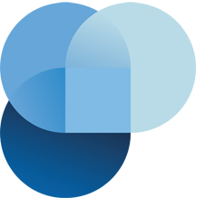

<div align="center"> <a href="https://github.com/sommer78/"> 
 </a> <br> <br>

[](LICENSE)

<h1>Laputa IOT Platform Admin</h1>
<h2>based in Vue3.0 typescript Vben </h2>

</div>


**English** | [中文](./README.zh-CN.md)

## Introduction

Laputa IOT Platform Admin is a free and open source middle and back-end template. Using the latest `vue3`, `vite2`, `TypeScript` and other mainstream technology development, the out-of-the-box middle and back-end front-end solutions can also be used for learning reference.

## Feature

- **State of The Art Development**：Use front-end front-end technology development such as Vue3/vite2
- **TypeScript**: Application-level JavaScript language
- **Theming**: Configurable themes
- **International**：Built-in complete internationalization program
- **Mock Server** Built-in mock data scheme
- **Authority** Built-in complete dynamic routing permission generation scheme.
- **Component** Multiple commonly used components are encapsulated twice
- **UPMS**  Based in SpringCloud security oauth2.0 and  UML Profile and Metamodel for Service
- **Code Generator**  Pull and draggle to make code easy
- **Instant Message**  Based in websocket  instant message
- **BPMN WORKFLOW**  Based in BPMN SERVICE

### 

Open the project in Vscode and start coding immediately.


## Preparation

- [node](http://nodejs.org/) and [git](https://git-scm.com/) - Project development environment
- [Vite](https://vitejs.dev/) - Familiar with vite features
- [Vue3](https://v3.vuejs.org/) - Familiar with Vue basic syntax
- [TypeScript](https://www.typescriptlang.org/) - Familiar with the basic syntax of `TypeScript`
- [Es6+](http://es6.ruanyifeng.com/) - Familiar with es6 basic syntax
- [Vue-Router-Next](https://next.router.vuejs.org/) - Familiar with the basic use of vue-router
- [Ant-Design-Vue](https://2x.antdv.com/docs/vue/introduce-cn/) - ui basic use
- [Mock.js](https://github.com/nuysoft/Mock) - mockjs basic syntax

## Install and use

- Installation dependencies

```bash

yarn install

```

- run

```bash
yarn serve
```

- build

```bash
yarn build
```


## Project

- [laputa-iot-dashboard](https://github.com/sommer78/laputa-iot-dashboard) - Frontend
- [laputa-iot-msa](https://github.com/sommer78/laputa-iot-msa) - Backend

## Preview


## How to contribute

You are very welcome to join！[Raise an issue](https://github.com/sommer78/laputa-iot-dashboard/issues/new/choose) Or submit a Pull Request。

**Pull Request:**

1. Fork code!
2. Create your own branch: `git checkout -b feat/xxxx`
3. Submit your changes: `git commit -am 'feat(function): add xxxxx'`
4. Push your branch: `git push origin feat/xxxx`
5. submit`pull request`

## Git Contribution submission specification

- reference [vue](https://github.com/vuejs/vue/blob/dev/.github/COMMIT_CONVENTION.md) specification 

  - `feat` Add new features
  - `fix` Fix the problem/BUG
  - `style` The code style is related and does not affect the running result
  - `perf` Optimization/performance improvement
  - `refactor` Refactor
  - `revert` Undo edit
  - `test` Test related
  - `docs` Documentation/notes
  - `chore` Dependency update/scaffolding configuration modification etc.
  - `workflow` Workflow improvements
  - `ci` Continuous integration
  - `types` Type definition file changes
  - `wip` In development

## Related warehouse

If these plugins are helpful to you, you can give a star support

- [vite-plugin-mock](https://github.com/anncwb/vite-plugin-mock) - Used for local and development environment data mock
- [vite-plugin-html](https://github.com/anncwb/vite-plugin-html) - Used for html template conversion and compression
- [vite-plugin-style-import](https://github.com/anncwb/vite-plugin-style-import) - Used for component library style introduction on demand
- [vite-plugin-theme](https://github.com/anncwb/vite-plugin-theme) - Used for online switching of theme colors and other color-related configurations
- [vite-plugin-imagemin](https://github.com/anncwb/vite-plugin-imagemin) - Used to pack compressed image resources
- [vite-plugin-compression](https://github.com/anncwb/vite-plugin-compression) - Used to pack input .gz|.brotil files
- [vite-plugin-svg-icons](https://github.com/anncwb/vite-plugin-svg-icons) - Used to quickly generate svg sprite

## Browser support

The `Chrome 80+` browser is recommended for local development

Support modern browsers, not IE

| [](http://godban.github.io/browsers-support-badges/)</br>IE | [](http://godban.github.io/browsers-support-badges/)</br>Edge | [](http://godban.github.io/browsers-support-badges/)</br>Firefox | [](http://godban.github.io/browsers-support-badges/)</br>Chrome | [](http://godban.github.io/browsers-support-badges/)</br>Safari |
| :-: | :-: | :-: | :-: | :-: |
| not support | last 2 versions | last 2 versions | last 2 versions | last 2 versions |

## Maintainer

[@Sommer](https://github.com/sommer78)

## Donate

If you think this project is helpful to you, you can help the author buy a cup of coffee to show your support!


## Discord

- [github discussions](https://github.com/sommer78/laputa-iot-dashboard/discussions)

## License

[MIT © laputa-iot.com 2021-2025](./LICENSE)

